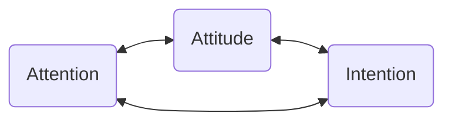

# Toward an Integrated Life

**A Course on Reflection and Contemplative Practices**

*WEEK 1: MOTIVATION & BEGINNER'S MIND*

---

## Opening Exercise

**Take 5 minutes and complete the sentence "I AM..." ten times.**

*Keep this somewhere you won't forget it so we can return to it throughout the course.*

---

## Introductions

- Name
- Year and Major
- Highlight of Your Summer Break
- Definition of Meaning *in* Life

---

## Motivation

- Goal: Develop a personal approach to self-reflection and attunement 
	+ Self-Reflection: An ongoing practice of understanding the workings of our minds, our values, our aspirations
	+ Attunement: Bringing our lives into ever greater alignment with our values and aspirations
+ Method: a laboratory model of self-inquiry
	+ Non-judgmental observation of mental activity, mental models, behaviors
	+ Experimenting with our subjective experience
	+ Critical subjectivity

---

### Laboratory of Self-Inquiry

+ Systematic study of the self through observation, experimentation, and hypothesis testing
+ Contemplative practices: methods of observation and experimentation applied to our first-person experiences
+ “If you want to understand your mind, sit down and observe it.” - Munindra
+ "All of humanity's problems, stem from man's **inability to sit quietly in a room alone**.” - Pascal
	+ To observe the mind is simple but not easy (like the mind has a mind of its own)
+ **Let's try it. Close your eyes (if it's comfortable) and sit in silence for three minutes.** 

---

#### Discussion

- What was that like? 
- What did you notice?
- What was going on in your mind?
	- Did you have complete control (or predictive power) over your thoughts the whole time?
- If it was a challenge, why?

---

#### A few notes

- Though many of the readings and practices in this course come from spiritual/religious traditions, our approach will be entirely empirical and experiential. 
- Beware of the *positive outcome bias*
	- Though biased toward positive results, we learn just as much, if not more, from negative results
	- The important thing is to **stay curious**
		- If you feel you aren't getting something out of a particular experiment, ask why, impartially and non-judgmentally

---

### Socrates: An Origin Story

+ Pythia, the Oracle at Delphi, communed with the gods
	+ "Should I marry Elton?" 💘
	+ "Sometimes snow melts by moonlight?" 🌖
+ Socrates friends asked the oracle if there was any Greek wiser than Socrates 🏛️
	+ She replied, "No."
+ He did the *opposite of what our confirmation bias would have us do*: **he set out to prove her wrong.**
+ Through probing lines of questioning, he found that those who claimed wisdom didn't know how much wisdom they lacked.

---

#### Wisdom and Self-Deception

+ Socrates uncovered the self-deception of those who claimed to be wise
+ His wisdom lay in his recognition of his lack of wisdom *and* his method for overcoming self-deception
+ The pursuit of happiness requires the wisdom to know not just what goods to pursue in life, but also the right use of those goods in the service of happiness. 
	+ The kind of *happiness* referred to in these philosophical works is not happiness in the everyday sense, but rather ***eudaimonic happiness.*** 
 

---

"\[E\]udaimonic happiness is not a passing mood or a fleeting feeling of elation but rather **an abiding state of felicity emanating from leading a life that is worth living** – which for Socrates, Plato, and Aristotle would be a life of virtue or moral excellence." - Dhiman, S. (2021).

---

#### On Bullshit

+ Famous essay/book by Harry Frankfurt
+ Distinction between the liar and the bullshit artist
	+ Liar: someone who deliberately promulgates a falsehood
		+ Cares about the truth value of the statements they make
	+ Bullshit artist: doesn't care about the truth but only about how they are perceived
		+ "The bullshitter may not deceive us, or even intend to do so, either about the facts or about what he takes the facts to be. What he does necessarily attempt to deceive us about is his enterprise."
+ **Question: Is it possible to lie to yourself? Or can we only bullshit ourselves?**

---

### Forms of Self-Deception

- Our senses deceive us
- Negativity bias and threat detection
- The rider and the elephant
- Motivated reasoning and motivated numeracy

---

### Nine Dot Problem

Connect all nine dots with four straight lines without picking up your pen/pencil

![[NineDots.png|400]]

---

#### Our strengths come with costs

+ Our brains are like the ultimate pattern-finding engines
+ We are constantly taking in a (literally) astronomical amount of sense data, both internally and externally
+ Our minds filter at will
	+ Cocktail party effect, for example
+ How do we know we're always filtering out the right stuff?

---

#### The Dress that Broke the Internet

![[Pasted image 20240830123000.png]]

---

#### Negativity Bias

+ We're still operating with machinery that evolved for very different conditions: wandering the wild
+ It's 10,000 years ago and your wandering the savannah
	+ You see a long dark object in the brush and assume it's a snake
	+ You act accordingly
	+ Even if you're wrong 999 times out of 1000, it's worth it for the 1 time it saves your life

---

#### The Rider and the Elephant

- We hear all of this and think, "I'm more rational than that."
+ Modern view: we're like a rider on an elephant trying to guide it along
	+ If the elephant wants to go left, it's going left
	+ We're more like the PR person for the elephant, doing damage control by providing reasoning for the elephants behavior
	+ We all experience this when we react to an object coming at us before we know what we're doing

---

#### Motivated Numeracy

- In 2017, Dan Kahan et. al. looked at why public conflict over societal risks persists in the face of compelling and widely accessible scientific evidence
- Not only are people more likely to misinterpret data in favor of their biases and preexisting beliefs, but **those who scored higher on a general numeracy test were _more likely_ to do so!**
	- In other words, the better you are at math, the *more likely* you are to misinterpret data in favor of your biases.
	- Regardless of political orientation
- Identity protective cognition thesis

---

### What do we do?

- One option is the Socratic approach
	- Reason applied to all of our assumptions
	- Dialectic
- From the other side of the world, Buddhist philosophy and practice offers another view

---

## Beginner's Mind

If your mind is empty, it is always ready for anything; it is open to everything. In the beginner’s mind there are many possibilities; in the expert’s mind there are few. - Shunryu Suzuki

---

### Staying Curious

- The more we think we know, the less likely we are to explore new possibilities, new ways of understanding our area of expertise.
	- This goes for self-knowledge as well. 
+ *The End of History Fallacy*
	- We all underestimate how much we'll change in the future
	- Dan Gilbert: "works in progress that mistakenly think they're finished."
+ Creativity: **"Every object well-contemplated opens a new organ of perception in us"** - Goethe 
+ Implications for wellbeing: Research on [[self-actualization]] has shown that **continued freshness of appreciation** is one of the defining characteristics of the most self-actualized, happiest, most fulfilled people.

---

## Mindfulness

+ What is it?
+ Origin: Pali word *sati,* which means deep remembrance
	+ Mindfulness is remembering to be present, to pay attention, to by open, curious, and non-judgmental
+ Modern definition: paying attention in a particular way: on purpose, in the present moment, and non-judgmentally
	+ Intention (on purpose): intentions shift, along a continuum from self regulation, to self exploration, and finally to self liberation
	+ Attention: suspend our usual ways of interpreting experience and overlaying it with concepts
	+ Attitude: *openness* and *curiosity* 

---

### Non-Buddhist Definitions

+ Sufi poet Rumi: 
	- This being human is a guest house.  
	- Every day a new arrival.  
	- A joy, a depression, a meanness,   
	- some momentary awareness comes   
	- as an unexpected visitor.  
	- Welcome and entertain them all! 
+ Ellen Langer: the opposite of *mindlessness*
	+ *premature cognitive commitment*.

---

### A Working Definition

+ Our intention is to observe, with lucid awareness, our present moment experience, without judgment or conceptual interpretation, and with a spirit of curiosity and openness (i.e., with beginner's mind).
+ *ehipassiko:* come and see

---

## The Dialectic of Meditation and Contemplation

![[Meditation-Mindfulness-Contemplation.png]] 

+ Meditation is "frame-breaking"
	+ Take off and examine glasses themselves
+ Contemplation is "frame-making"
	+ Put glasses back on and look at the world

---

### Practice: Six Anchors

---

### Practice: Well Meditation

---

