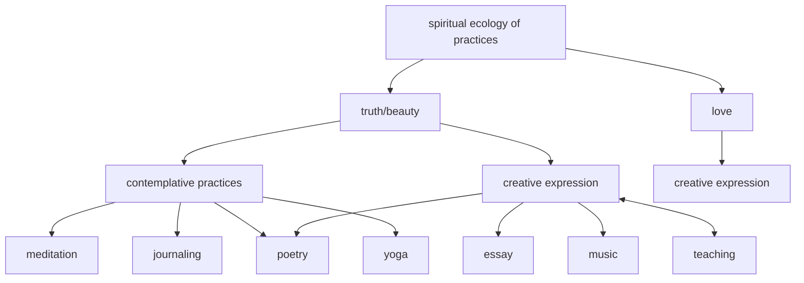
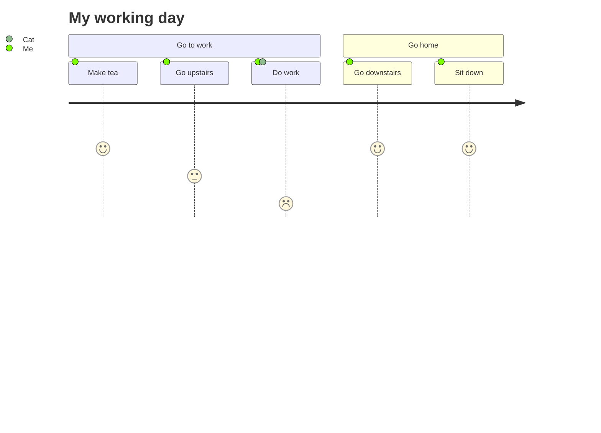
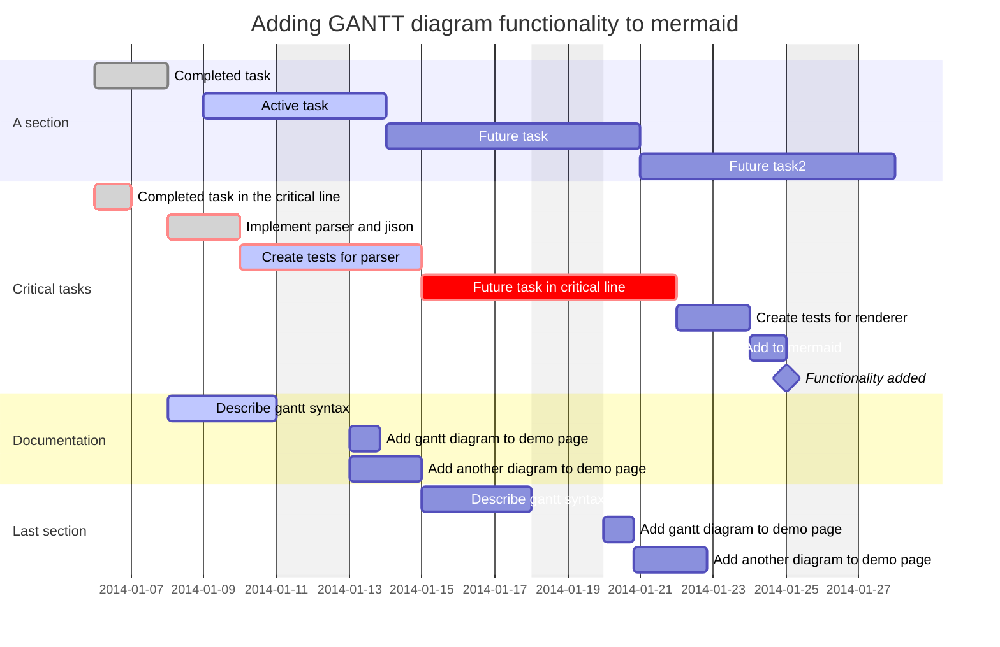
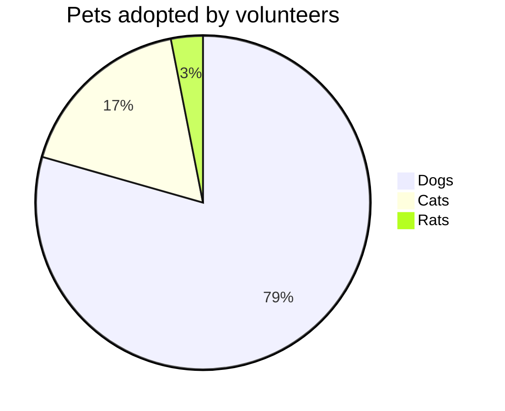
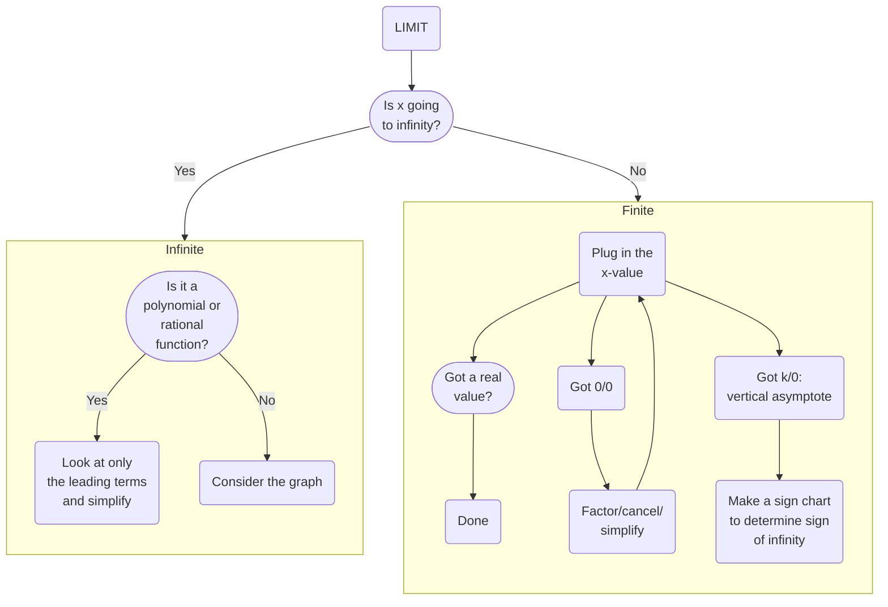
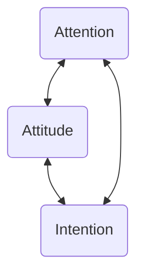
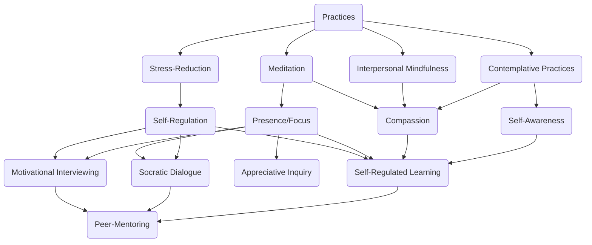

# Mermaid Diagrams

## Examples
### Flow Chart
```[mermaid]
flowchart
1[spiritual ecology of practices] --> truth/beauty
1 --> love
truth/beauty --> 2[contemplative practices]
truth/beauty --> 3[creative expression]
love --> 4[creative expression]
2 --> meditation
2 --> journaling
2 --> poetry
2 --> yoga
3 --> poetry
3 --> essay
3 --> music
3 --> teaching
```



### Journey



```[mermaid]
journey 
title My working day 
section Go to work 
	Make tea: 5: Me 
	Go upstairs: 3: Me 
	Do work: 1: Me, Cat 
section Go home 
	Go downstairs: 5: Me 
	Sit down: 5: Me
```


### Gantt


```[mermaid]
gantt
    dateFormat  YYYY-MM-DD
    title       Adding GANTT diagram functionality to mermaid
    excludes    weekends
    %% (`excludes` accepts specific dates in YYYY-MM-DD format, days of the week ("sunday") or "weekends", but not the word "weekdays".)

    section A section
    Completed task            :done,    des1, 2014-01-06,2014-01-08
    Active task               :active,  des2, 2014-01-09, 3d
    Future task               :         des3, after des2, 5d
    Future task2              :         des4, after des3, 5d

    section Critical tasks
    Completed task in the critical line :crit, done, 2014-01-06,24h
    Implement parser and jison          :crit, done, after des1, 2d
    Create tests for parser             :crit, active, 3d
    Future task in critical line        :crit, 5d
    Create tests for renderer           :2d
    Add to mermaid                      :1d
    Functionality added                 :milestone, 2014-01-25, 0d

    section Documentation
    Describe gantt syntax               :active, a1, after des1, 3d
    Add gantt diagram to demo page      :after a1  , 20h
    Add another diagram to demo page    :doc1, after a1  , 48h

    section Last section
    Describe gantt syntax               :after doc1, 3d
    Add gantt diagram to demo page      :20h
    Add another diagram to demo page    :48h
```


### Pie Chart


```[mermaid]
pie title Pets adopted by volunteers
    "Dogs" : 386
    "Cats" : 85
    "Rats" : 15
```


### Quadrant

```[mermaid]
quadrantchart title Reach and engagement of campaigns
	x-axis Low Reach --> High Reach
	y-axis Low Engagement --> High Engagement
	quadrant-1 We should expand
	quadrant-2 Need to promote
	quadrant-3 Re-evaluate
	quadrant-4 May be improved
	Campaign A: [0.3, 0.6]
	Campaign B: [0.45, 0.23]
	Campaign C: [0.57, 0.69]
	Campaign D: [0.78, 0.34]
	Campaign E: [0.40, 0.34]
	Campaign F: [0.35, 0.78]
```

## Resources
- [Official Documentation](https://mermaid.js.org/intro/)
- [Medium Article](https://medium.com/@ensleytan/how-mermaid-diagrams-work-in-obsidian-b7680fe00fa8)

## Related Notes
- [Obsidian](Obsidian.md)


## Experimenting

```mermaid
---
displayMode: compact
---

gantt
	dateFormat HH:mm
	axisFormat %H:%M
	Wake up : milestone, m1, 06:00, 0m
	section Day Plan
	
	Coffee and writing : 30m
	Meditation : 15m
	Work on curriculum : 07:00, 1h
```




```
graph
L(LIMIT)
L --> q([Is x going <br> to infinity?])
subgraph Finite
direction TB
p(Plug in the <br> x-value) --> a([Got a real <br> value?])
a --> D(Done)
p --> z(Got 0/0)
z --> s(Factor/cancel/<br>simplify)
s --> p
p --> u(Got k/0: <br>vertical asymptote)
u --> c(Make a sign chart <br>to determine sign <br>of infinity)
end
subgraph Infinite
direction TB
y([Is it a <br>polynomial or <br>rational <br>function?]) -- Yes --> l(Look at only <br>the leading terms <br>and simplify)
y -- No --> g(Consider the graph)
end
q -- Yes --> Infinite
q -- No --> Finite
```







