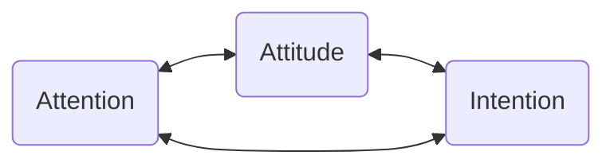

Before we can discuss how mindfulness practices can serve as an expression of or training in [[Beginner's Mind|beginner's mind,]] we should have at least a *working definition* of what mindfulness is. By working definition, I mean a definition that is imperfect and ever-evolving, but sufficient to get us started with our practice. Ideally, such a definition would serve not just as a description of the state (or trait) of mindfulness, but will also provide some insight into *how* one ought to practice mindfulness.

> For a more detailed treatment of this exploration, read [[Defining Mindfulness|this long form essay.]]

## Coming to a Working Definition of Mindfulness
It seems like everywhere we look these days, mindfulness is being marketed to us as a spiritual technique for self-improvement, as a panacea for all of our woes, as a *life hack* for becoming calmer, more productive, and finding our bliss. I would argue that many, if not most of these conceptions, are rooted in a watered down version of mindfulness. Some have called this watered down version of mindfulness, [McMindfulness](https://www.mountaincloud.org/beyond-mcmindfulness-by-david-loy-part-1/?gad_source=1&gbraid=0AAAAAoxNAY8kYCBG-0YRgWwypNyUH0mB6&gclid=Cj0KCQjwlvW2BhDyARIsADnIe-IksiFU-iB94HNz7Ezi9aQVz0cS-yDQUlhDtV4Xw5f7yBbTakHzOZkaAsQoEALw_wcB), pointing to the ways in which a consumerist view of mindfulness robs it of context. With that in mind, we'll start with some historical context. 

### Etymology
The term *mindfulness* is now widespread in both popular culture and academic literature. Though it is often considered to have its roots in Eastern traditions, especially Buddhism, the core ideas of mindfulness can be found in many other philosophical and religious traditions. Let's take the Buddhist view as a starting point. 

In [Pali](https://en.wikipedia.org/wiki/Pali) - the language spoken by the historical Buddha - the word most often translated as mindfulness is *sati.* Sati means something like *deep remembrance.* Taking this etymology into account, we might think of mindfulness as an act of remembering to be present, remembering to pay attention, remembering to be non-judgmental, remembering to be open and curious. But, as it's used in much of the Buddhist literature on meditation, sati also carries the connotation of attention, awareness, and cultivation.  

Bhikkhu Bodhi points out that in the classic Buddhist text on mindfulness practice, the Satipatthana Sutta,[^1] mindfulness occurs as part of *contemplation* or *observation*. In that text, mindfulness is established with ardor, clear comprehension, and without grasping of pushing away one's present-moment experience. Bodhi suggests a wonderful, succinct definition of mindfulness: "lucid awareness of the phenomenal field."[^2] 

Bodhi's definition implies that mindfulness entails *clear seeing* (lucid awareness) of the *whole of our experience* (phenomenal field). This points to one key feature of mindfulness practice: nothing is left out. Everything we experience is a candidate for becoming an object of our awareness. His use of the word "field" also captures the sense of an unbroken, undifferentiated whole. 

Let's compare this with some modern definitions. 

### Modern Definitions
If we fast-forward to modern mindfulness discourse, we find that Jon Kabat-Zinn's definition is often taken as the starting point for mindfulness training: "paying attention in a particular way: on purpose, in the present moment, and non-judgmentally"[^zinn1]. Kabat-Zinn's definition can be seen as an attempt to secularize the Buddhist conception of mindfulness while still honoring its roots. We can think of this definition as having three interrelated components: intention (on purpose), attention (paying attention), and attitude (in a particular way).[^shapiro] 

Intention is an essential ingredient in the sense that one needs a personal vision or guiding set of values that is both dynamic and evolving. D. H. Shapiro found that "as meditators continue to practice, their intentions shift, along a continuum from self regulation, to self exploration, and finally to self liberation."[^shapiro] The meditation teacher Adyashanti identifies "clarifying one's aspiration" as the first foundation of the contemplative path[^adya] 

Attention is the aspect of mindfulness that we hear the most. Most mindfulness training begins with learning to pay *attention* to the breath. The philosopher Husserl said that attention is "to return to things themselves." In other words, to truly pay attention is to suspend our usual ways of interpreting experience and overlaying it with concepts. We attend to experience - the whole, unbroken phenomenal field - just as it is, moment-by-moment, without judgment. This is sometimes called *bare attention* - attention without interpretation.

Finally, we have attitude. Though non-judgmental, bare attention might give us the sense that mindfulness is about cold indifferent, the attitude we bring to our practice (along with our intention) can change the quality of our attention. In Japanese, the character for mindfulness includes the character for heart, giving us a translation closer to "heart-mindfulness." This is echoed in meditation teacher Diana Winston's definition: "Paying attention in a particular way: on purpose, in the present moment, with openness and curiosity." Here, Winston highlights the attitudinal qualities of *openness* and *curiosity*. 

### Non-Buddhist Definitions
In nearly every mindfulness-based stress reduction program, participants read the Sufi poet Rumi's [[The Guesthouse]]. This poem highlights several other characteristics of mindfulness, such as a welcoming spirit and gratitude. Rumi begins, 

> This being human is a guest house.  
> Every day a new arrival.  
>
> A joy, a depression, a meanness,   
> some momentary awareness comes   
> as an unexpected visitor.  
> 
> Welcome and entertain them all! 

As in Bodhi's succinct definition, we include the whole of our experience, leaving nothing out, with a spirit of welcoming. 

For a more modern, non-Buddhist definition of mindfulness, we can turn to the work of Ellen Langer.[^langer-roll] Langer based her work on the opposite of mindfulness: mindlessness. She has done some tremendous studies on the deleterious effects of mindlessness. In one of her more well-known studies, residents in a nursing home were provided a plant that they were expected to care for. There was a control group who were told that the staff would take care of the plant for them. The group that cared for their plants had radically better health outcomes, and a mortality rate less than half of that of the control group. Langer defined mindlessness in terms of what she called *premature cognitive commitment*. In other words, mindlessness arises from a sense of *already knowing.* 

## Working Definition + Beginner's Mind
Let's review the definitions we've explored so far: 

- Etymologically, mindfulness is about *remembering* to be present, to pay attention, to be aware. 
- Mindfulness is "lucid awareness of the phenomenal field," meaning that mindfulness is about clearly seeing and being aware that we're seeing, the unbroken, undifferentiated whole of our experience.
- Mindfulness is "paying attention in a particular way: on purpose, in the present moment, and non-judgmentally"[^zinn1]
- Mindfulness entails intention, attention, and awareness. 
- Mindfulness is not a cold and indifferent kind of attention, but can include qualities like openness, curiosity, welcoming, and gratitude. 
- Rather than coming from the mindless place of "already knowing," mindfulness comes from a place of not knowing. 

One thing that's missing in these definitions is the social aspect of mindfulness. My teacher, Don McCown,[^don1] suggests mindfulness is co-created by the relationships within a given group. This is evident at a large scale in the few definitions we've covered here. Each tradition emphasizes different aspects of mindfulness. In every workshop, class, or meditation group, a different understanding of mindfulness emerges on account of the experiences, understandings, and insights of each member *as well as* the unique dynamic of the group. **In a community, the whole is greater than the sum of its parts.** 

In Zen, they say that a word is like a "finger pointing at the moon." We don't want to mistake the finger for the moon. What I've tried to provide here is a bunch of fingers pointing at the same moon. None of these definitions is the absolute, correct definition of mindfulness, but they're all pointing to it. My goal is provide some useful language to get us started and to nurture an environment of curiosity, openness, and safety in which the meaning of mindfulness unique to our group can emerge and evolve freely and dynamically. 

If I had to pick one feature common to most definitions, it would be [[Beginner's Mind|beginner's mind]]. Our intention is to observe, with lucid awareness, our present moment experience, without judgment or conceptual interpretation, and with a spirit of curiosity and openness. The Buddha himself instructed his followers not to take any of his teachings at face value, saying "ehipassiko," meaning "come and see."[^ehipassiko] With this in mind, my approach to teaching mindfulness in is one of ehipassiko: **let's sit together and see what comes up.** 

[^1]: The [Satipatthana Sutta](https://www.accesstoinsight.org/tipitaka/mn/mn.010.nysa.html) ("The Discourse on the Establishment of Mindfulness") and the [Anapanasati Sutta](https://www.accesstoinsight.org/tipitaka/mn/mn.118.than.html) ("Breath-Mindfulness Discourse") are texts from the [Pali Canon](https://www.accesstoinsight.org/tipitaka/), which outline, in detail, the basic practice of mindfulness. For a comprehensive analysis of the Satipatthana Sutta, check out *[Mindfulness](https://a.co/d/5OKtO2z)* by Joseph Goldstein. 

[^2]: Bodhi, B. (2013). What does mindfulness really mean? A canonical perspective. In _Mindfulness_ (pp. 19–39). Routledge.

[^zinn1]: Kabat-Zinn, J., & Hanh, T. N. (2009). _Full catastrophe living: Using the wisdom of your body and mind to face stress, pain, and illness_. Delta.

[^shapiro]: Shapiro, S. L., Carlson, L. E., Astin, J. A., & Freedman, B. (2006). Mechanisms of mindfulness. _Journal of Clinical Psychology_, _62_(3), 373–386. [https://doi.org/10.1002/jclp.20237](https://doi.org/10.1002/jclp.20237)

[^adya]: *The Way of Liberation* by Adyashanti

[^langer-roll]: [This](https://www.youtube.com/watch?v=upTm2kTYxNQ) is a great interview with Langer. 

[^don1]: McCown, D. (2013). _The Ethical Space of Mindfulness in Clinical Practice : An Exploratory Essay_. Jessica Kingsley Publishers. [https://search.ebscohost.com/login.aspx?direct=true&AuthType=shib&db=e000xna&AN=553295&site=ehost-live&scope=site&custid=s3916018](https://search.ebscohost.com/login.aspx?direct=true&AuthType=shib&db=e000xna&AN=553295&site=ehost-live&scope=site&custid=s3916018)

[^ehipassiko]: Fleischman, P. (2005). The Buddha Did Not Teach Buddhism. _Insight Journal_, _Fall_, 7–11.