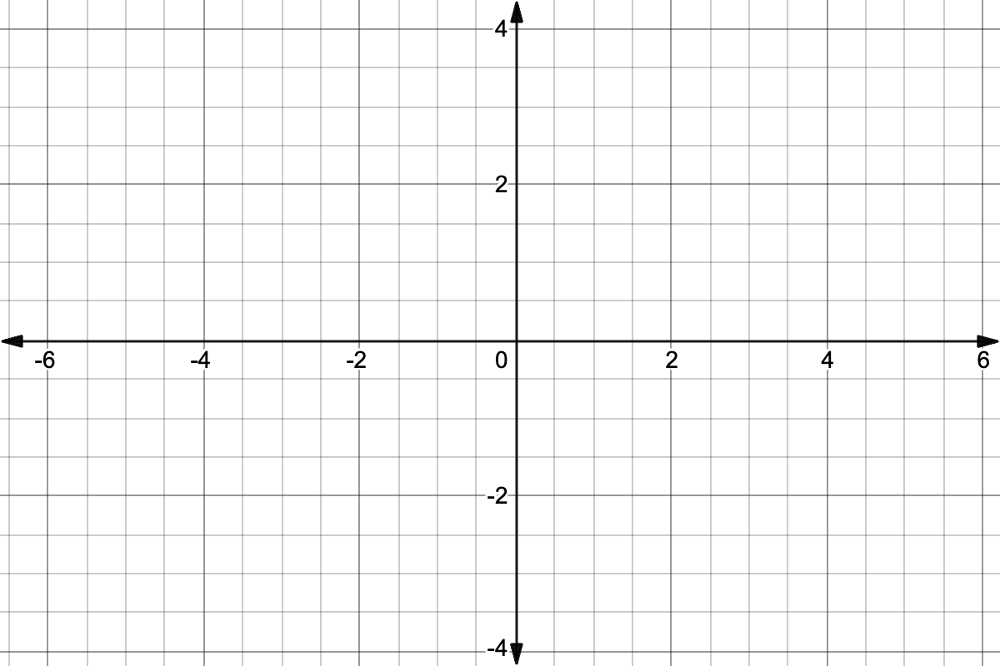

\newpage
## Overview

> This study guide lays out an effective and efficient approach to preparing for the first exam in differential calculus. The goal is to avoid ineffective strategies, to maximize conceptual understanding and problem-solving skills, and to feel confident in that knowledge. This last part - feeling confident in our knowledge - is essential!

In order for this to be effective, you should try to start at least four days before the exam. 

Breakdown (with suggested timeline): 

- **Part 1 (~2 hours):** Review of Concepts using Active Recall.
	- Start this at least four days before the exam and work in 30-minute chunks.
	- This is best done solo. 
	- If you can't fill a section in after thinking about it for a while, leave it blank. You'll come back to it in the next section. 
- **Part 2 (~2-3 hours depending on part 1):** Filling in the Gaps and Practicing
	- Again, do this in 30-minute chunks with breaks in between.
	- This can be done with friends. 
- **Part 3 (50 minutes + bonus studying):** Testing our Knowledge with a Practice Exam

**Go through these parts in this order.** 

## Part 1: Review of Concepts using [Active recall](https://wealldomath.com/notes/generalstudyhabits/#active-recall)

We'll begin by going through each of the topics covered on the exam and writing down as much as we can remember from each topic **without looking at any notes or other resources.** Doing this first sweep through the topics without looking over our notes is key. This is called [*active recall*](https://wealldomath.com/notes/generalstudyhabits/#active-recall), and it's one of the most effective ways to learn. When you make up your own examples, you can check your answer by using [Wolfram Alpha](https://www.wolframalpha.com) or a similar online calculator. 

> *If you start working on this part and feel completely stuck or at a loss, set it aside and review your notes. Got back through all of the skeleton notes I've posted and see how much you can fill in. Then return to this review.*

### An Intuitive Approach to Limits

Write the definition of the limit of a function. What does it mean when we say $\lim_{x \to a} f(x) = L$?

\vfill

What is a one-sided limit and how are one-sided limits related to two-sided limits?

\vfill

How are vertical asymptotes defined (in terms of limits)?

\vfill

What is the relationship between $f(a)$ and $\lim_{x\to a}f(x)$?

\vfill

\newpage

Draw a graph that demonstrates all of these limit concepts. It should include places where the limit exists, where only the one-sided limits exist, where there are vertical asymptotes, etc. and then write out all the relevant limits. 

In other words, **create your own problem of the sort we did in this section.**

\vfill

\newpage
### Computing Limits

For non-piecewise functions, when $x\to a$ we discussed **three cases.** Write out those three cases, what we do in each case, and come up with example problems for each. Don't worry about the order of the cases.

#### Case 1: We plug in $x=a$ and get...

**What do you do in this case?**

\vfill

**Write down 3 - 5 examples of limits that fit this case and solve them.**

\vspace{4cm}
\vfill

#### Case 2: We plug in $x=a$ and get...

**What do you do in this case?**

\vfill

**Write down 3 - 5 examples of limits that fit this case and solve them.**

\vspace{4cm}

\vfill

\newpage
#### Case 3: We plug in $x=a$ and get...

\vfill

**What do you do in this case?**

\vfill

**Write down 3 - 5 examples of limits that fit this case and solve them.**

\vspace{4cm}
\vfill

### Limits at Infinity

#### Polynomials

**How do we compute the limits at infinity (end behavior) for polynomials?**  

\vfill

**Write down 3 - 5 examples of limits that fit this case and solve them.**  

\vspace{6cm}

\vfill

\newpage

### Continuity

#### Definition

**When a function, $f$,  is continuous at $x=a$, what three things are true?**

1.   

2.  

3.  

**Draw an example of what it looks like when condition 1 isn't met.**

\vfill

**Draw an example of what it looks like when condition 2 isn't met, but condition 1 is.**

\vfill

**Draw an example of what it looks like when condition 3 isn't met, but conditions 1 and 2 both are.**

\vfill

\newpage

#### Examples

**Draw a graph that has multiple points of discontinuity. Then state the intervals on which $f$ is continuous.**

\vfill

**Write an example of a piecewise function with at least two pieces. Determine any points of discontinuity.**

\vfill

\newpage

### Limits of Trig Functions

#### $\sin x$ and $\cos x$

Since sine and cosine are both continuous everywhere, we know that...

$$\lim_{x \to a} \sin x = \hspace{5cm} \lim_{x \to a} \cos x = $$ 
But...

$$\lim_{x \to \pm \infty} \sin x = \hspace{5cm} \lim_{x \to \pm\infty} \cos x = $$

#### The other four trig functions

The other four trig functions all have vertical asymptotes. Write down and solve one example of a one-sided limit for each function ($\sec x, \csc x, \cot x, \tan x$) where the limit is $\pm \infty$. 

\newpage

#### Using $\lim_{\theta\to 0}\frac{\sin\theta}{\theta} = 1$

Write down and solve two easy examples and two more challenging examples of limits that use $\lim_{\theta\to 0}\frac{\sin\theta}{\theta} = 1$.

\newpage

### Rates of Change

#### Average Rate of Change

##### Definition

Write the formula for computing the _average rate of change_ of $f$ over $[a,b]$. 

\vspace{2cm}

**The average rate of change gives us the slope of what kind of line?**

\vspace{1cm}

##### Example

Pick a relatively simple function and an interval $[a,b]$. Compute the average rate of change of your function over your chosen interval. 

\vspace{3cm}

#### Instantaneous Rate of Change

##### Definition

Write the formula for computing the _instantaneous rate of change_ of $f$ at $x = a$. 

\vspace{2cm}

**The instantaneous rate of change gives us the slope of what kind of line?**

\vspace{1cm}

##### Examples

Pick a relatively simple function and an $x$-value. Compute the instantaneous rate of change of your function at your chosen $x$-value. 

\vspace{6cm}

### Definition of the Derivative

**Write the limit definition of the derivative.** 

\vspace{2cm}

**Use the limit definition of the derivative to compute the derivative of at least two different functions, including basic power functions, quadratic functions, radicals, and simple rational functions.** 

\vspace{12cm}
#### Differentiability

If a function is continuous but not differentiable at a point $x = a$, what might the graph look like at that point. Draw an example.

\newpage

## Part 2: Filling in the Gaps + Practice

You've now done a thorough review of all the core concepts we've covered so far. In doing so, you probably identified areas where you need to put in more work and areas where you need less work. 

### Filling in the Gaps 

- Go back through your notes, the posted class notes, and the other resources provided to see how well you did in answering all of the above. 
- If you left any areas blank, put a star next to them. 
- Correct any mistakes and add to any incomplete responses. 

### Practice

- Start with the sections you starred and go to the [practice problems](https://www.math.drexel.edu/classes/Calculus/math121.html) for that section. 
	- Try to do at least the first quarter of the problems in that section. 
- For the sections where you felt confident, pick problems at random to try (don't go in order). 

## Part 3: Testing our Knowledge with a [Practice Exam](https://wealldomath.com/documents/exams/Math121202315Exam1.pdf)

Now, set aside 50 minutes where you can mimic testing conditions: put away all your notes and devices, set a timer, and work on the exam as if you're taking it for real. 

Once your done, check your answers and solutions against the [answer key](https://wealldomath.com/documents/exams/Math121202315Exam1Solutions.pdf). For any problems you got wrong, make note of which topics were covered in that problem.

How do the topics you struggled with on the exam align with the topics you struggled with in the review above?

Find some time to practice solving more problems from those topics. Ideally, do this with friends on a board. Take turns solving problems for one another. Challenge each other with problems. 