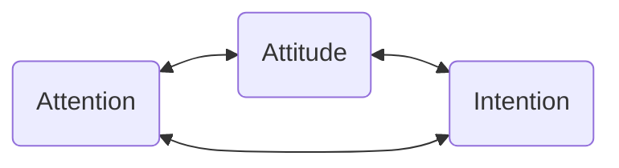

# Nurturing Curiosity and Compassion through Mindfulness

Dimitri Papadopoulos

---

## Overview

### Session 1
Introduction to Mindfulness   
Mindfulness as an Orientation

### Session 2
Benefits of Mindfulness for Educators  
Mindfulness: The Pedagogy is the Practice

---

## An Experiment

Let's sit in silence for three minutes

~

+ **Discussion**
	+ What was that like?
	+ What did you notice?
	+ Was that a mindfulness/meditation practice?

---

## Mindfulness: A Very Brief Introduction

**Goal:** Provide some practices, language, and frameworks to help support fruitful exploration and discussion.

---

### Mindfulness as Remembrance

+ "At the heart of all classical systems of Buddhist meditation is a particular discipline that has come to be known as mindfulness." [@bodhiWhatDoesMindfulness2013]
+ The Pali word most often translated as mindfulness is *sati*.
	+ Memory, remembrance
	+ Remembering to be present, to pay attention, to begin again

---

### Mindfulness-Based Stress Reduction

+ Jon Kabat-Zinn first defined mindfulness in the context of the **Mindfulness-Based Stress Reduction (MBSR)** program he developed in **1979**.
	+ UMASS Medical Center
	+ Foundation of most clinical applications of and research on mindfulness
+ JKZ: *awareness that arises through **paying attention**, **on purpose**, **in the present moment**, **non-judgmentally***

---

### Ellen Langer (a non-Buddhist definition)

+ American psychologist and professor at Harvard University
+ Made history in 1981 as the first woman to gain tenure in the psychology department at Harvard 
+ Research: **mindfulness**, the **illusion of control**, decision-making, and aging.
	+ Plant study: late 1970s w/ Judith Rodin [@langerEffectsChoiceEnhanced1976a]
+ Mindfulness: **the simple act of actively noticing new things.** 
+ Mindlessness: a state of mind characterized by an **over-reliance on past categories and distinctions** (*premature cognitive commitment*)

---

### From the Literature

+ Intention + Attention + Awareness [@shapiroMechanismsMindfulness2006]
+ "\[A\] particular type of social practice that leads the practitioner to an ethically minded awareness, intentionally situated in the here and now" [@nilssonReconcilingThematizingDefinitions2016] 
+ Self-regulation of attention on immediate experience + orientation toward one's experience of curiosity, openness, and acceptance [@bishopMindfulnessProposedOperational2004] 
+ Mindfulness is co-created by the relationships within a given group [@mccownEthicalSpaceMindfulness2013] 
	+ "The pedagogy is the practice."
+ "Ehipassiko" - "come and see" (Fleischman 2005)

---

### Seven Anchors Practice

---

#### Discussion

- What did you notice?
- How did that compare to sitting in silence?
- What do we cultivate through such a practice?

---

## Mindfulness as an Orientation

> This being human is a guest house.  
> Every day a new arrival.  
>
> A joy, a depression, a meanness,   
> some momentary awareness comes   
> as an unexpected visitor.  
> 
> Welcome and entertain them all! 

---

### Discussion

Based on our practice together so far, how would you characterize the orientation we bring to, or cultivate through, mindfulness?

---

![[NineDots.png]]

---

### Beginner's Mind

+ *Zen Mind, Beginner's Mind:* **"In the beginner's mind there are many possibilities, but in the expert's there are few."** [@suzukiZenMindBeginner2020]
	+ Unbridled curiosity
+ Langer's definition: **the simple act of actively noticing new things.**
	+ Overlaps with research on self-actualization: continued freshness of experience
+ Goethe: "Every object well-contemplated opens a new organ of perception in us."
+ Play + Experimentation
	+ We conduct experiments and observe
	+ We can set up the conditions for *fun* but can't force ourselves to have fun

---

### Coordinating Intention, Attention, and Attitude

+ **Intention**: D. H. Shapiro found that "as meditators continue to practice, their intentions shift, along a continuum from self regulation, to self exploration, and finally to self liberation."
+ **Attitude**: Non-judgmental
	+ Neither pushing away what is unpleasant nor grasping onto what is pleasant
	+ "Paying attention in a particular way: on purpose, in the present moment, with openness and curiosity." - Diana Winston
+ **Attention**: Present-moment
	+ Types: focused attention, open monitoring
		+ Balancing the two
	+ Husserl: "to return to things themselves."

---

### Not a deficiency mindset

+ Fromm's being-mode rather than having-mode
+ Zen: you're perfect just as you are, and you could use a little improvement
+ There's no bad meditation
	+ The moment you notice you've become distracted is the moment of mindfulness
	+ All objects of attention are permissible

---

### Self-Compassion

+ When we start to see with greater clarity the way our mind's operate, we won't always like what we find. 
+ It's easy to get frustrated by our inability to stop the proliferation of distracting thoughts
+ In practice, we cultivate this by first noticing the tendency to judge: good, bad, too distracted, too tired, too anxious, too annoyed, too impatient. 
	+ Instead, we notice with a greater sense of openness, and some distance: there is distraction, there is impatience, there is annoyance

---

### Practice

Simple breath-focused anchoring practice into open monitoring

---

## Benefits of Mindfulness for Educators

---
### Discussion

What benefits do you see in adopting a mindfulness orientation and/or practicing mindfulness?

---
## Mindfulness: The Pedagogy is the Practice

---

